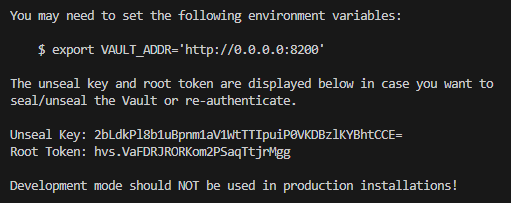
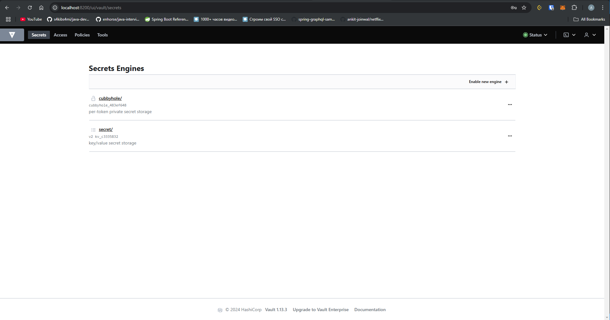
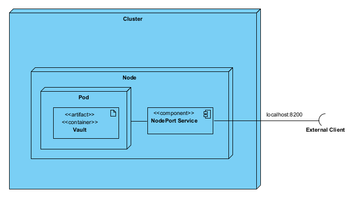

# Лабораторная работа №1 "Установка Docker и Minikube, мой первый манифест."

University: [ITMO University](https://itmo.ru/ru/)\
Faculty: [FICT](https://fict.itmo.ru)\
Course: [Introduction to distributed technologies](https://github.com/itmo-ict-faculty/introduction-to-distributed-technologies)\
Year: 2024/2025\
Group: K4111c\
Author: Pasichnik Artyom Arkadevich\
Lab: Lab1\
Date of create: 20.11.2024\
Date of finished: 


## Цель
Ознакомиться с инструментами Minikube и Docker, развернуть свой первый "под".

## Ход работы

После скачивания докер образа Vault и установки minikube развертываем minikube cluster 
```
minikube start
```

Пишем IAAC manifest деплоймента одного пода в файле manifest.yaml
```yml
apiVersion: apps/v1
kind: Deployment
metadata:
  name: vault
spec:
  replicas: 1
  selector:
    matchLabels:
      app: vault
  template:
    metadata:
      labels:
        app: vault
    spec:
      containers:
        - name: vault
          image: vault:1.13.3
          ports:
            - containerPort: 8200
```

В конфигурации деплоймента:

* .metadata.name - имя деплоймента
* .spec.replicas количество реплик, которые будут управляться ReplicaSet
* .spec.selector определяет как ReplicaSet находит поды, которыми нужно управлять. В данном случае выбирается label определенный в темплейте пода .template.metadata.labels

В конфигурации темплейта пода:
* .metadata.labels - префикс названий подов
* .spec - спецификация пода, которая говорит о том, что поды запускают один контейнер vault, который использует конкретный образ


Применим деплоймент командой
```
kubectl apply -f manifest.yml
```

После этого в k8s создастся один деплоймент и один под

Реализуем доступ к поду извне через службу NodePort, указав имя пода
```
kubectl expose pod vault-[HASH] --type=NodePort --port=8200
```

Пробросим порты для доступа к поду
```
kubectl port-forward service/vault-[HASH] 8200:8200
```

Теперь мы имеем доступ к поду локально. После перехода по localhost:8200 откроется интерфейс входа в Vault. Для аутентификации потребуется токен, который показывается при старте контейнера, найдем его подключившись к логам пода в отдельной консоли:
```
kubectl logs vault-[HASH]
```


Нас интересует строчка Root Token, скопировав ее и вставив в форму аутентификации мы попадаем в Vault:



## UML Deployment диаграмма:


