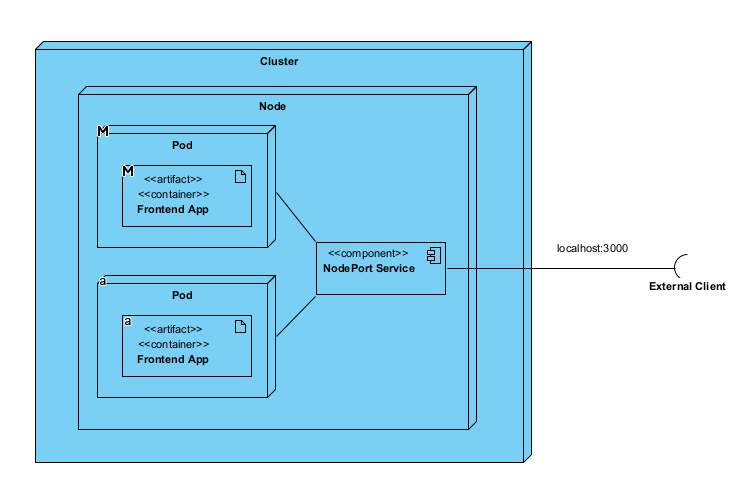

# Лабораторная работа №2 "Развертывание веб сервиса в Minikube, доступ к веб интерфейсу сервиса. Мониторинг сервиса."

University: [ITMO University](https://itmo.ru/ru/)\
Faculty: [FICT](https://fict.itmo.ru)\
Course: [Introduction to distributed technologies](https://github.com/itmo-ict-faculty/introduction-to-distributed-technologies)\
Year: 2024/2025\
Group: K4111c\
Author: Pasichnik Artyom Arkadevich\
Lab: Lab2\
Date of create: 25.11.2024\
Date of finished: 


## Цель
Ознакомиться с типами "контроллеров" развертывания контейнеров, ознакомится с сетевыми сервисами и развернуть свое веб приложение.

## Ход работы

Создаем манифест manifest.yml, который содержит в себе:

1. Deployment

```yml
apiVersion: apps/v1
kind: Deployment
metadata:
  name: frontend-for-lab2
spec:
  replicas: 2
  selector:
    matchLabels:
      app: frontend-for-lab2
  template:
    metadata:
      labels:
        app: frontend-for-lab2
    spec:
      containers:
        - name: frontend-for-lab2
          image: ifilyaninitmo/itdt-contained-frontend:master
          env:
            - name: REACT_APP_USERNAME
              value: "apschni"
            - name: REACT_APP_COMPANY_NAME
              value: "bebracorp"
          ports:
            - containerPort: 3000
              name: http
```

Указываем количество реплик - 2, а так же в шаблоне пода прокидываем переменные окружения

2. Сервис
```yml
apiVersion: v1
kind: Service
metadata:
  name: frontend-for-lab2
spec:
  type: NodePort
  ports:
    - port: 3000
      targetPort: 3000
      protocol: TCP
      name: http
  selector:
    app: frontend-for-lab2
```

По сути для каждого пода, который будет создан ReplicaSet мы описываем так же конфигурацию NodePort для доступа извне, указывая конкретный целевой порт в контейнере и в k8s, а так же селектор для того, чтобы определить к каким подам будет относиться NodePort

Создадим сервис и поды:
```
kubectl apply -f manifest.yml
```

Подключаемся извне, перед этим пробросив порты:
```
kubectl port-forward service/frontend-for-lab2 3000:3000
```

Видим, что при доступе к странице в имени контейнера мы получаем одно и то же значение. Это связано с тем, что NodePort сервис по умолчанию не производит никакого распределения нагрузки и адресует запрос на одну из запущенных нод (похоже на то, что первую в списке).


## UML Deployment диаграмма:




