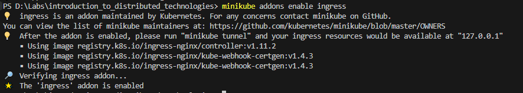
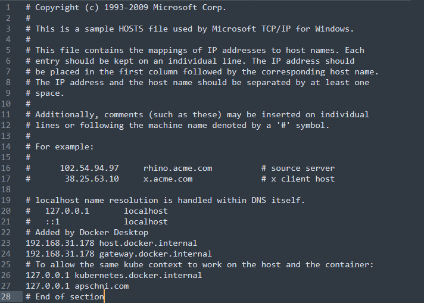
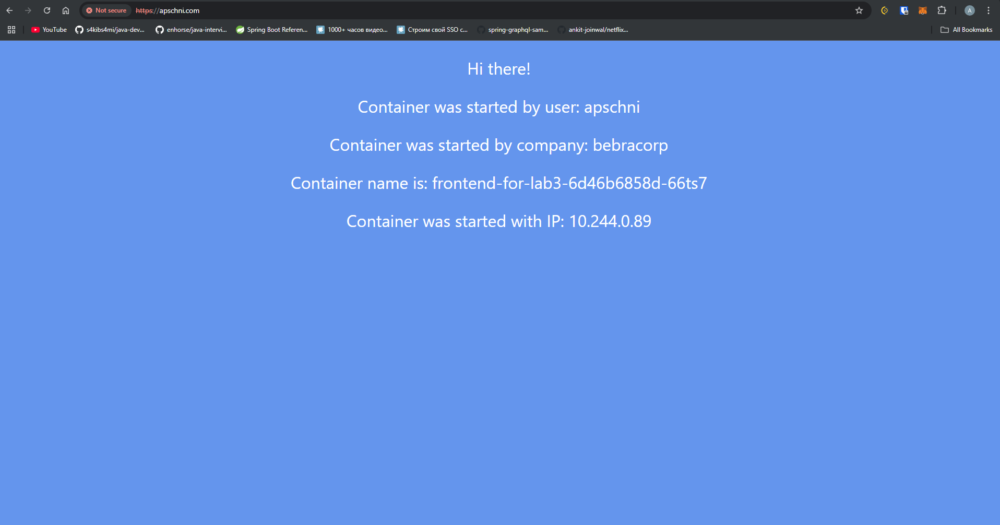
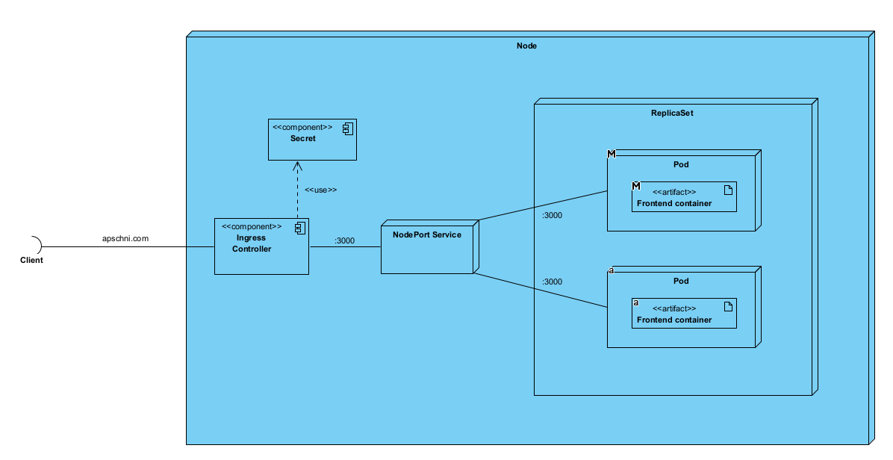

# Лабораторная работа №2 "Развертывание веб сервиса в Minikube, доступ к веб интерфейсу сервиса. Мониторинг сервиса."

University: [ITMO University](https://itmo.ru/ru/)\
Faculty: [FICT](https://fict.itmo.ru)\
Course: [Introduction to distributed technologies](https://github.com/itmo-ict-faculty/introduction-to-distributed-technologies)\
Year: 2024/2025\
Group: K4111c\
Author: Pasichnik Artyom Arkadevich\
Lab: Lab3\
Date of create: 05.12.2024\
Date of finished: 


## Цель
Познакомиться с сертификатами и "секретами" в Minikube, правилами безопасного хранения данных в Minikube.

## Ход работы

Создаем манифест manifest.yml, который содержит в себе:

1. ConfigMap

```yml
apiVersion: v1
kind: ConfigMap
metadata:
  name: frontend-config
data:
  REACT_APP_USERNAME: "apschni"
  REACT_APP_COMPANY_NAME: "bebracorp"
```

Указываем секреты, которые будет хранить этот конфиг

2. Деплоймент
```yml
apiVersion: apps/v1
kind: Deployment
metadata:
  name: frontend-for-lab3
spec:
  replicas: 2
  selector:
    matchLabels:
      app: frontend-for-lab3
  template:
    metadata:
      labels:
        app: frontend-for-lab3
    spec:
      containers:
        - name: frontend-for-lab3
          image: ifilyaninitmo/itdt-contained-frontend:master
          envFrom:
            - configMapRef:
                name: frontend-config
          ports:
            - containerPort: 3000
              protocol: TCP
              name: http
```

Такой же деплоймент, как в лабораторной работе 2 (2 реплики внутри replicaSet).

3. Service
```yml
apiVersion: v1
kind: Service
metadata:
  name: lab3-service
spec:
  type: NodePort
  selector:
    app: frontend-for-lab3
  ports:
    - port: 3000
      targetPort: 3000
      protocol: TCP
      name: http
```

Сервис так же не притерпел изменений по сравнению с прошлой лабораторной работой.

4. Ingress
```yml
apiVersion: networking.k8s.io/v1
kind: Ingress
metadata:
  name: lab3-ingress
spec:
  tls:
    - hosts:
        - apschni.com
      secretName: frontend-tls
  rules:
    - host: apschni.com
      http:
        paths:
          - path: /
            pathType: Prefix
            backend:
              service:
                name: lab3-service 
                port:
                  name: http
```

Указываем, откуда берем секреты (имя секрета frontend-tls). Указываем так же хост, который будет мапиться на этот контроллер, а так же пути, для которых будут работать указанные правила. В нашем случае это рутовый путь /.

Далее сгенерируем сертификат и приватный ключ:
```
openssl req -x509 -newkey rsa:4096 -nodes -keyout cert.key -out cert.pem -days 365 -subj "/CN=apschni.com" -addext "subjectAltName = DNS:apschni.com, DNS:www.apschni.com"
```

И добавим их в качестве секрета с именем frontend-tls:
```
kubectl create secret tls frontend-tls --key="cert.key" --cert="cert.crt"
```

Подключим аддон Ingress:


Создадим сервис и поды с ингрессом:
```
kubectl apply -f manifest.yml
```

В файл hosts пропишем домен для подключения:



И запустим туннель до сервиса:
```
minikube tunnel
```

Подключаемся извне:


Видим, что при доступе к странице соединение защищено tls шифрованием нашим подписанным сертификатом.

## UML Deployment диаграмма:

