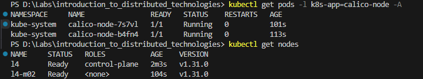
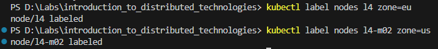
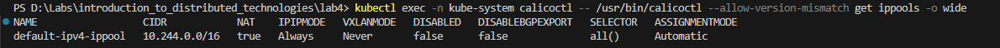
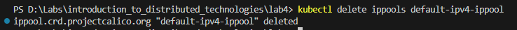
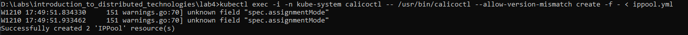
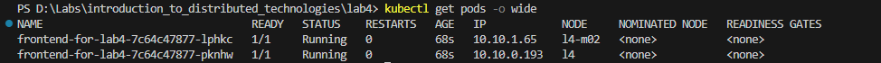
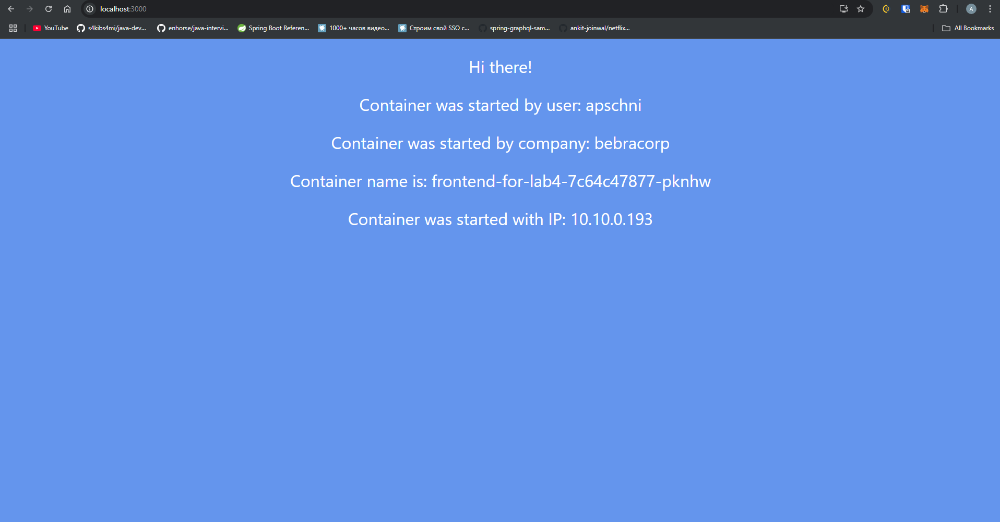
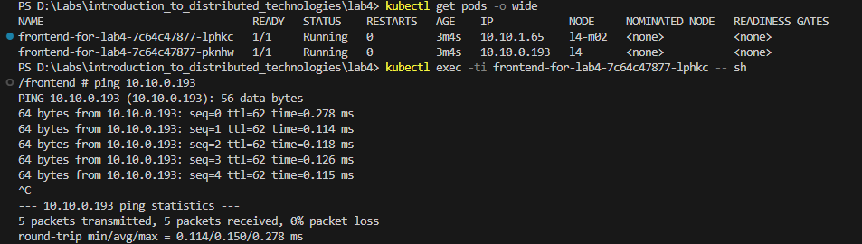
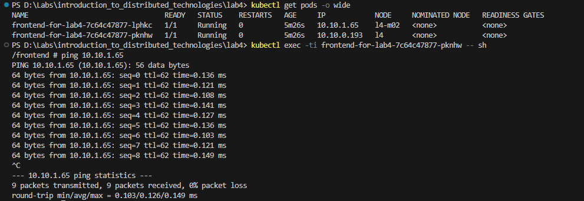
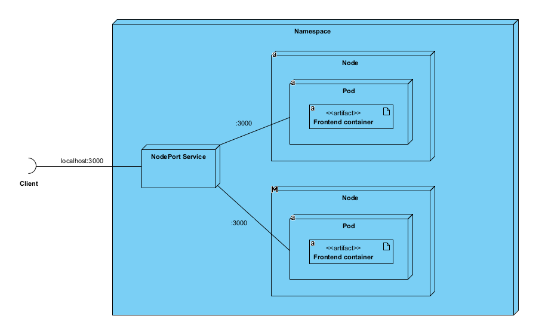

# Лабораторная работа №2 "Развертывание веб сервиса в Minikube, доступ к веб интерфейсу сервиса. Мониторинг сервиса."

University: [ITMO University](https://itmo.ru/ru/)\
Faculty: [FICT](https://fict.itmo.ru)\
Course: [Introduction to distributed technologies](https://github.com/itmo-ict-faculty/introduction-to-distributed-technologies)\
Year: 2024/2025\
Group: K4111c\
Author: Pasichnik Artyom Arkadevich\
Lab: Lab4\
Date of create: 08.12.2024\
Date of finished: 


## Цель
Познакомиться с CNI Calico и функцией IPAM Plugin, изучить особенности работы CNI и CoreDNS.

## Ход работы

Запускаем minikube с Calico и создаем две ноды:
```
minikube start --network-plugin=cni --cni=calico --nodes 2 -p l4
```

После старта проверим, что создалось две ноды и два пода:


Помечаем ноды метками кластера, я выбрал зоны в качестве маркера:


Настраиваем Calico. В первую очередь удаляем пул который создается по дефолту:



И создаем новый, используя конфигурацию:
```yml
apiVersion: projectcalico.org/v3
kind: IPPool
metadata:
   name: us-ippool
spec:
   cidr: 10.10.0.0/24
   ipipMode: Always
   natOutgoing: true
   nodeSelector: zone == "eu"
---
apiVersion: projectcalico.org/v3
kind: IPPool
metadata:
   name: eu-ippool
spec:
   cidr: 10.10.1.0/24
   ipipMode: Always
   natOutgoing: true
   nodeSelector: zone == "us"
```


Создаем манифест manifest.yml, который содержит в себе:

1. ConfigMap

```yml
apiVersion: v1
kind: ConfigMap
metadata:
  name: frontend-config
data:
  REACT_APP_USERNAME: "apschni"
  REACT_APP_COMPANY_NAME: "bebracorp"
```

Указываем секреты, которые будет хранить этот конфиг

2. Деплоймент
```yml
apiVersion: apps/v1
kind: Deployment
metadata:
  name: frontend-for-lab4
spec:
  replicas: 2
  selector:
    matchLabels:
      app: frontend-for-lab4
  template:
    metadata:
      labels:
        app: frontend-for-lab4
    spec:
      containers:
        - name: frontend-for-lab4
          image: ifilyaninitmo/itdt-contained-frontend:master
          resources: 
            limits:
              memory: "812M"
              cpu: "1"
          envFrom:
            - configMapRef:
                name: frontend-config
          ports:
            - containerPort: 3000
```

Такой же деплоймент, как в лабораторной работе 3. Отличие лишь, что я ограничил ресурсы для подов, так как иначе заканчивается память на компьютере.

3. Service
```yml
apiVersion: v1
kind: Service
metadata:
  name: lab4-service
spec:
  type: LoadBalancer
  selector:
    app: frontend-for-lab4
  ports:
    - port: 3000
      targetPort: 3000
```

Сервис так же не притерпел изменений по сравнению с прошлой лабораторной работой.

Применяем:
```
kubectl apply .\manifest.yml
```

Поды создались, причем им назначились айпи адреса в соответствии с региональным правилом, заданным ранее в двух разных нодах:


Подключаемся извне:


Теперь попробуем попинговать поды между собой:

из первого во второй


из второго в первый


## UML Deployment диаграмма:

